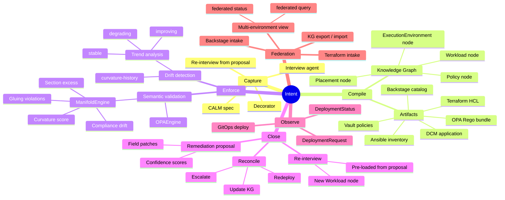

# CALM Forge — Overview

```mermaid
mindmap
  root((Intent))
    Capture
      CALM spec
      Decorator
      Interview agent
      Re-interview from proposal
    Compile
      Knowledge Graph
        Workload node
        Placement node
        Policy node
        ExecutionEnvironment node
      Artifacts
        Terraform HCL
        Vault policies
        OPA Rego bundle
        Ansible inventory
        Backstage catalog
        DCM application
    Enforce
      Semantic validation
        OPAEngine
        ManifoldEngine
          Curvature score
          Section excess
          Gluing violations
          Compliance drift
      Drift detection
        curvature-history
        Trend analysis
          improving
          stable
          degrading
    Close
      Reconcile
        Redeploy
        Update KG
        Escalate
      Remediation proposal
        Field patches
        Confidence scores
      Re-interview
        Pre-loaded from proposal
        New Workload node
    Observe
      GitOps deploy
      DeploymentRequest
      DeploymentStatus
    Federation
      Multi-environment view
        federated status
        federated query
      KG export / import
      Backstage intake
      Terraform intake
```
